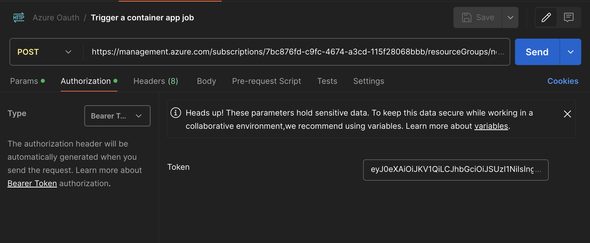

# Create SP with Terraform 
A service principal is required to trigger container app jobs via API.

# How to run this project
1. Create the sp with the following commands
    ```bash
    terraform validate;
    terraform apply -auto-approve;
    ```

2. Register the application of the sp. This generates a client (application) id and client secret that can be used to make requests to the management api. You'll have to do this in the azure portal.

# Authenticate to the management api
```text
POST https://login.microsoftonline.com/<tenant_id>/oauth2/token
```
See `x-www-form-urlencoded` body below.


# Trigger a container job
```text
POST https://management.azure.com/subscriptions/7bc876fd-c9fc-4674-a3cd-115f28068bbb/resourceGroups/new_rg/providers/Microsoft.App/jobs/test-dbt-dev-job/start?api-version=2023-11-02-preview

Bearer <Bearer token>
```


# Check the status of a container job run
```text
GET https://management.azure.com/subscriptions/7bc876fd-c9fc-4674-a3cd-115f28068bbb/resourceGroups/new_rg/providers/Microsoft.App/jobs/test-dbt-dev-job/executions/test-dbt-dev-job-qb3fimr?api-version=2023-11-02-preview
```
