# Run DBT Core on Azure with Containerapp Jobs
In this project, I've created a basic framework that can be used to run [dbt](https://docs.getdbt.com/) in your azure environment. The project serves as a starting point for stakeholders that want to start using *dbt-core* in their environments. **Terraform** is used to manage the resources used in this project. **Snowflake** is used as the platform for data warehousing.

# Tools
## Azure Resources
- Azure Containerapp Jobs
- Azure Blob Storage
- Azure Container Registry
- Azure Devops

## Scripting
- Bash

## IaC
- Terraform (not required)

## Warehouse
- Snowflake

# How to run the project
## Prerequisites
The following resources are required to successfully run this project.
1. Azure Subscription
2. Azure Devops account
3. A DBT Project
1. A [snowflake](https://signup.snowflake.com/?utm_cta=trial-en-www-homepage-top-right-nav-ss-evg&_ga=2.188006381.475331465.1716734919-206253400.1693358099&_fsi=6AsHo2Wc) account

## Setting up our environment
We'll learn how to set up our environment in the following sections:

1. [Provision Azure Resource](#provision-azure-resources)
1. [Push code to Azure Devops](#push-your-code-to-azure-devops)
1. [Create a service connection to ACR](#create-a-service-connection-to-acr)
1. [Set up CICD pipelines](#set-up-cicd-pipelines)

### Provision Azure Resources

1. Open a terminal session and log into your subscription with the [`az cli`](https://learn.microsoft.com/en-us/cli/azure/install-azure-cli)
    ```bash
    az login
    ```

1. Run the `.vars/.env.sh` file to to create the required environment variables in your session. **Note**, the `.vars/.env.sh` file is created from the `.vars/.template.env.sh` file.

    **DO NOT ADD THE `.env.sh` file to version control**.
    ```bash
    # You must be in the root dir
    . .vars/.env.sh
    ```

    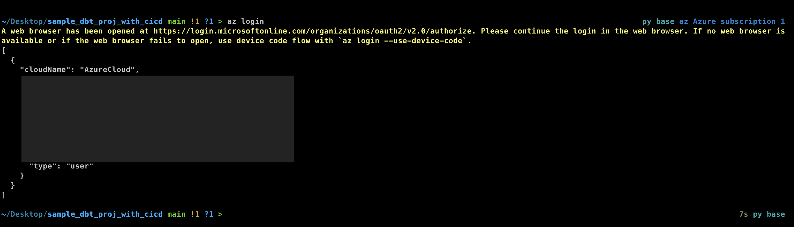

1. Navigate to the *IaC* directory and provision the necessary resources.
    ```
    # change directory
    cd IaC

    # validate the terraform configuration
    terraform validate

    # check which resources will be provisioned
    terraform plan

    # create the resources
    terraform apply -auto-approve
    ```

    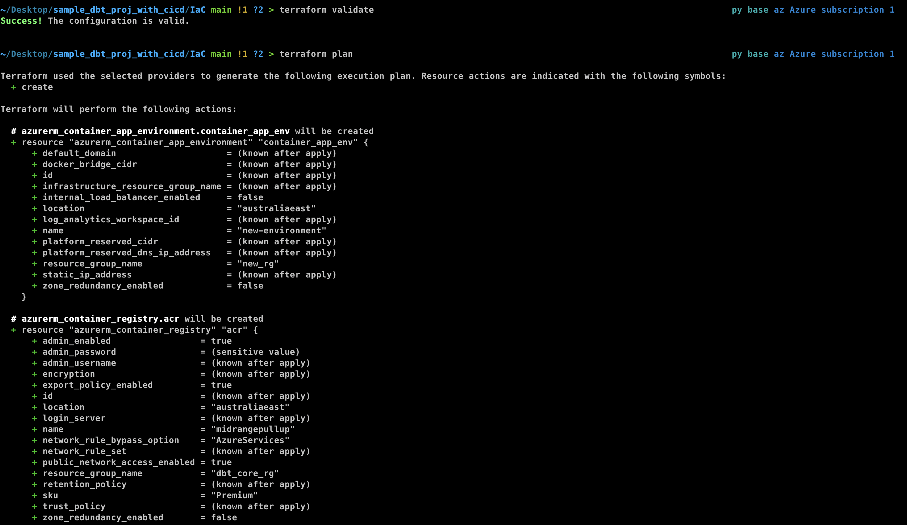

1. Navigate to the *IaC-ServicePrincipal* directory to create a service principal and an enterprise application with terraform. See [reference](#service-principals) to learn about service principals. The service principal will be used to **modify** the azure containerapp jobs; we have to create it [manually](./.workflows/bin/deploy_container_app_job.sh) for the first time. The service principal will also be assigned to an application that will allow us to trigger containerapp jobs via the Azure Management REST API.

    ```bash
    # change dir
    cd ../IaC-ServicePrincipal

    # validate configuration
    terraform validate

    # provision resources
    terraform apply -auto-approve
    ```
    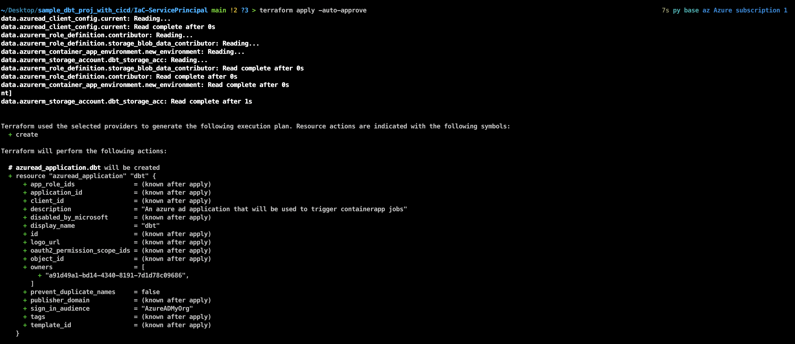


### Push your code to Azure Devops

1. Push your code to an azure devops repository.
    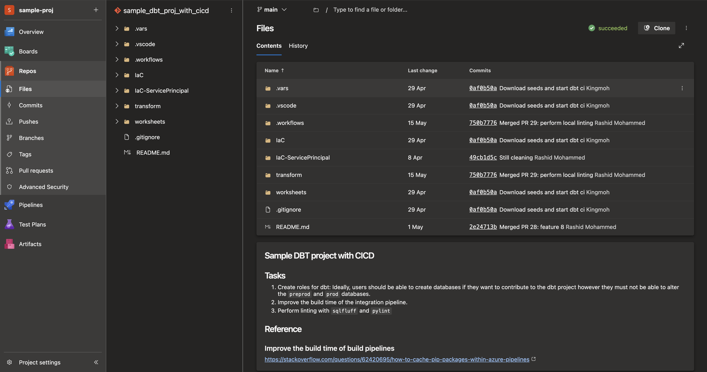

### Create a service connection to ACR
One of the artifacts deployed using the [deployment](./.workflows/cd/deployment.yml) pipeline is a container image. This is accomplished in azure devops using a [service connection](https://learn.microsoft.com/en-us/azure/devops/pipelines/library/service-endpoints?view=azure-devops&tabs=yaml). Use the steps below to create a service connection to your ACR.

1. Click on *Project Settings* at the bottom left of your screen.

    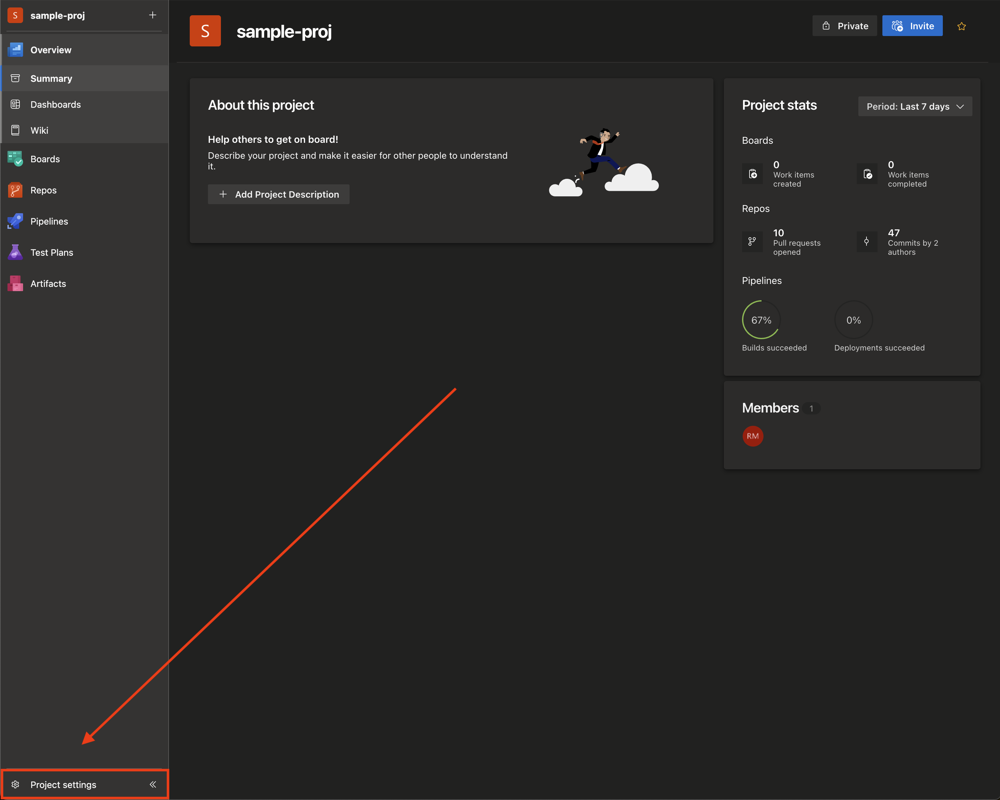

1.  Click on service connections and create a new service connection. In this case, my service connection is called `midrangepullup`. You may need to modify the [deployment.yml](./.workflows/cd/deployment.yml). At the time of development, I used the docker registry service *connection id* however you can also use the name of the service connection.

    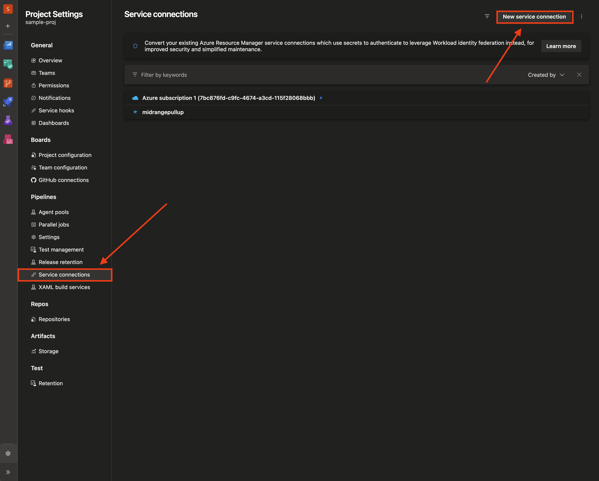

### Set up CICD Pipelines

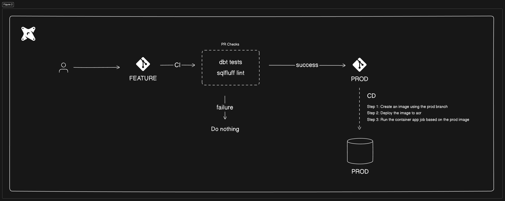

#### Workflow

1. Developer raises a PR.
1. We perform linting and dbt checks. See [integration.yml](./.workflows/ci/integration.yml) for all checks.
1. If all checks pass, then we can deploy the changes to production. See [deployment.yml](./.workflows/cd/deployment.yml). The deployment involves the following:

    - The creation of a new image.
    - The modification of the container app job to use the new image.

#### Pipeline Creation
1. In Azure Devops, create two pipelines namely:

    - *dbt_ci*
    - *dbt_cd*

    The *dbt_ci* pipeline is created from the [integration.yml](./.workflows/ci/integration.yml) file whereas the *dbt_cd* pipeline is created from the [deployment.yml](./.workflows/cd/deployment.yml) file. Make sure to provide all the necessary environment variables.

    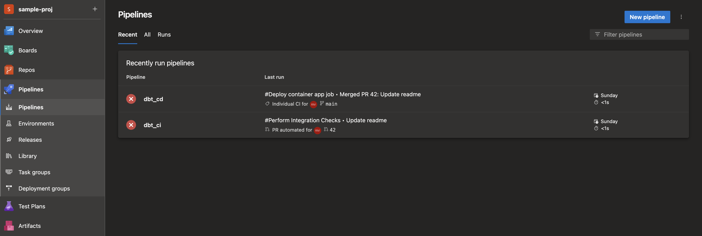


1. To run the pipelines, the required variables must be provided.

    | Variable | Comment
    |----------| --------
    | `CONNECTION_STRING` | A connection string to the storage account provisioned for this project.
    | `REGISTRY_PASSWORD` | Password to the ACR provisioned for this project
    | `REGISTRY_USER` | Username to the ACR provisioned for this project
    | `SNOWFLAKE_ACCOUNT` | Snowflake account used with the dbt project
    | `SNOWFLAKE_PASSWORD` | Snowflake password
    | `SNOWFLAKE_USERNAME` | Snowflake username
    | `SP_PASS` | Service Principal password
    | `SP_USER` | Service Principal username
    | `TENANT_ID` | Azure Tenant ID

    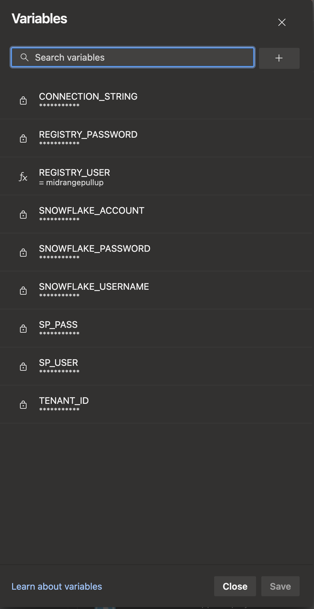

#### Pipeline Triggers and Runs
| Pipeline name | Trigger |
| --------------|---------------|
| *dbt_ci* | Triggered when a PR to the main branch is raised.
| *dbt_cd* | Triggered when a branch is merged into the main branch

To trigger the *dbt_ci* pipeline when a PR to the main branch is raised, add a build validation policy on the main branch.

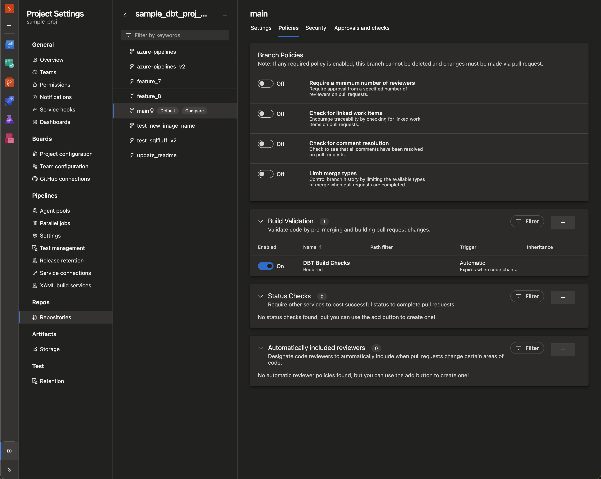

## Demo
### Presumptions
As aforementioned, we need to create the containerapp job [manually](./.workflows/bin/deploy_container_app_job.sh) for the first time.

1. An ACR has been provisioned
1. An image called *midrangepullup* has been pushed to the ACR.
1. A containerapp job called *midrangepullup* has been created with [*deploy_container_app_job.sh*](./.workflows/bin/deploy_container_app_job.sh)

### Workflow Demo
1. Make sure the environment variables for each pipeline have been updated.

1. Create a PR. In this PR:

    - We're modifying our readme. This means we can cancel both integration and deployment pipeline runs since no actual code change has been made. However for the purpose of this demo, we'll allow the pipelines to run when triggered.

    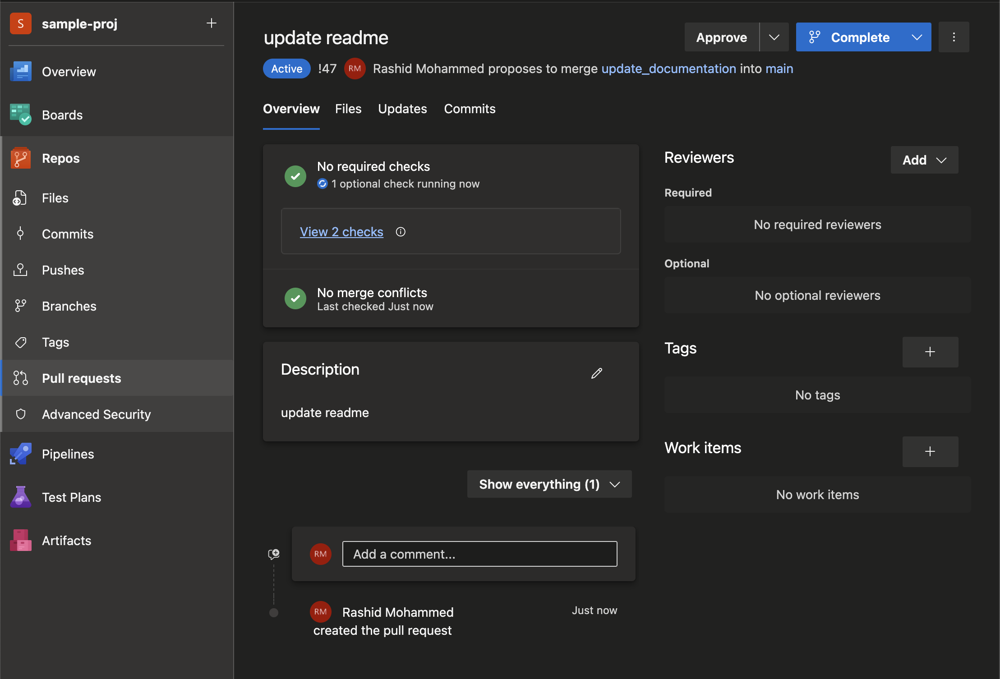

1. The creation of the PR triggers the *dbt_ci* pipeline. This is because we added the build validation.

    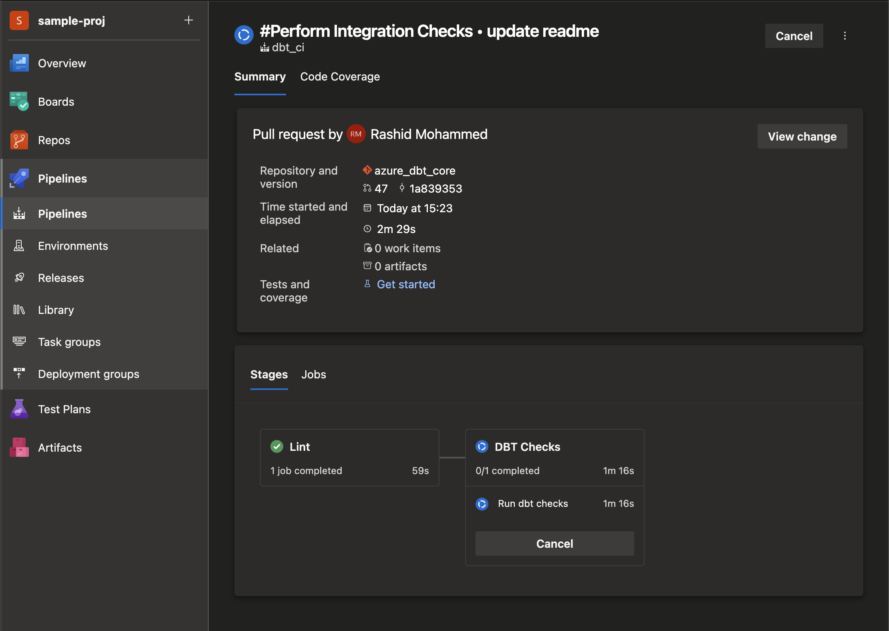


1. Once the checks pass, we can now merge to main. After merging to the main branch, the *dbt_cd* pipeline is triggered.

    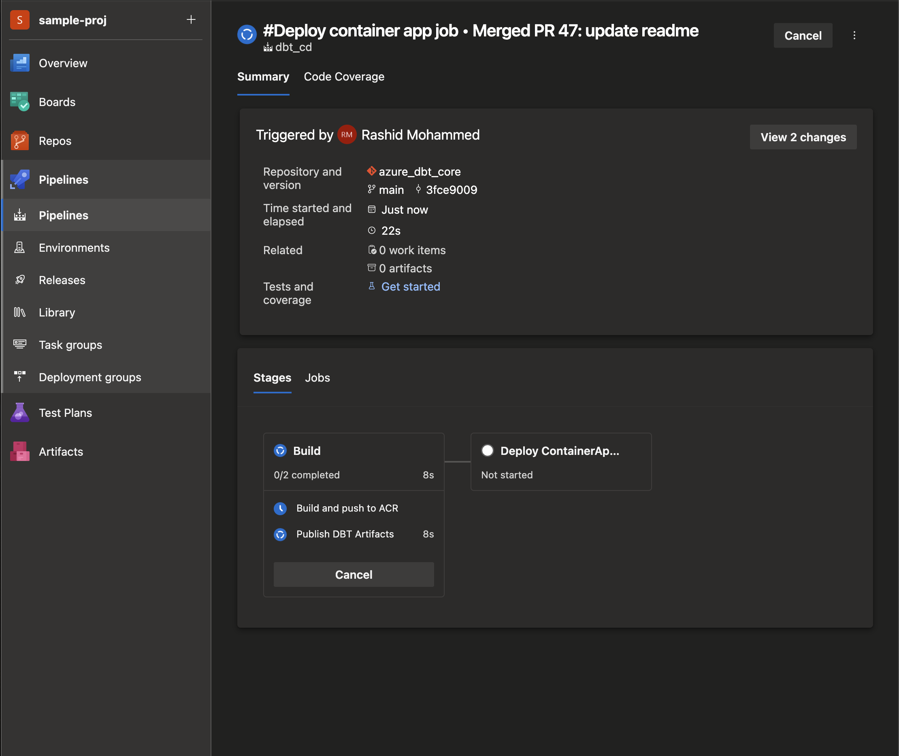

1. Inspect the logs to make sure all tasks completed as expected. In the image below, even though the *Publish dbt artifacts* step completed successfully, the dbt artifacts were not published to the storage account because of an invalid connection string.

    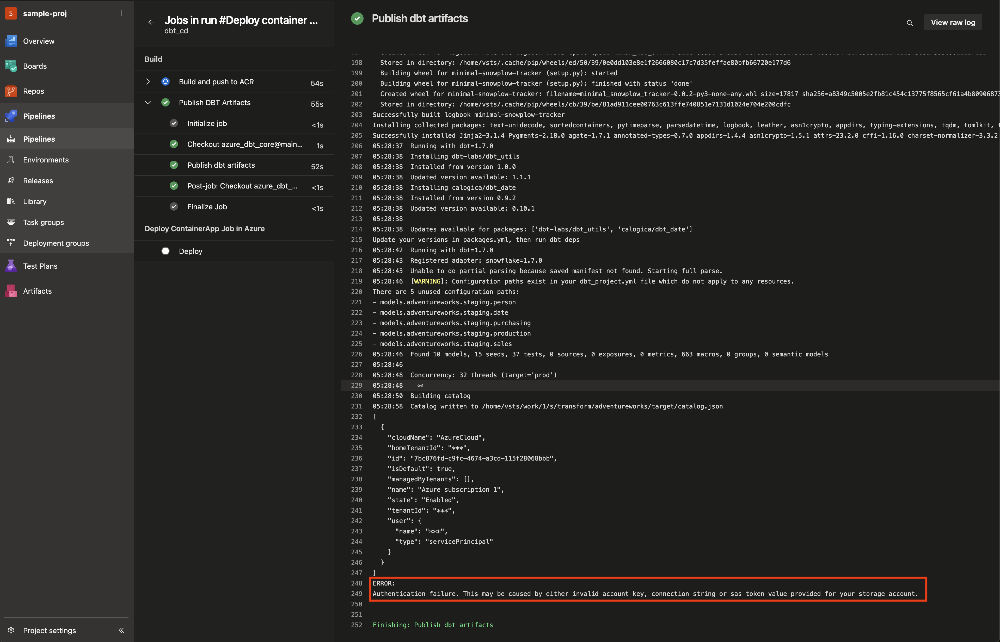

1. If everything succeeded, we should see that our containerapp job has been modified in place. We should now be able to trigger the containerapp job via the azure management rest api. See [how to authenticate to the Azure Management REST API](#how-to-authenticate-to-the-azure-management-rest-api)


# Trigger a containerapp job
In the following sections, we'll discuss how to trigger a containerapp job:

1. [How to authenticate to the Azure Management REST API](#how-to-authenticate-to-the-azure-management-rest-api)
1. [How to trigger a containerapp job](#how-to-trigger-a-containerapp-job-via-the-azure-management-rest-api)
1. [How to check the status of a containerapp job run](#how-to-check-the-status-of-a-containerapp-job-run)
1. [Inspect Job runs](#inspect-job-runs)

## How to authenticate to the Azure Management REST API
1. Open Microsoft Entra ID
1. Under the *Manage* section on the left pane, click on *App Registrations*.
    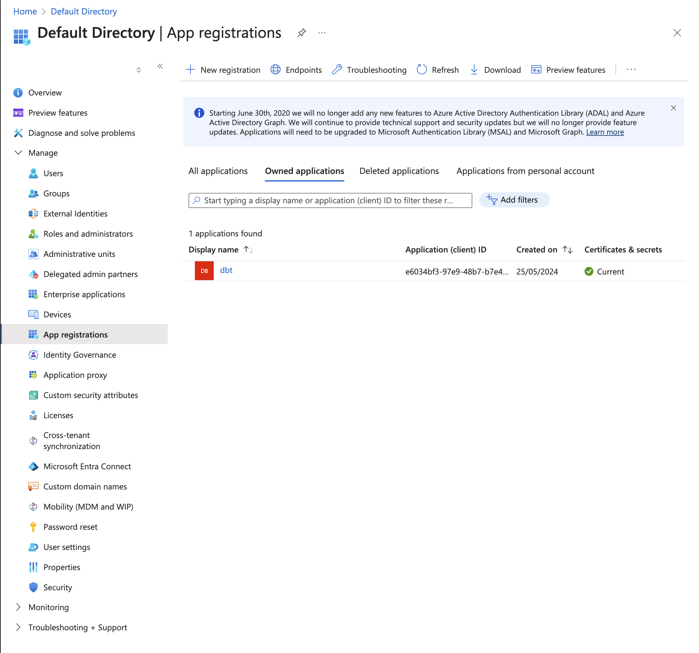
1. Click on *dbt*
1. Click on *Overview* and copy and save the *Application ID*
    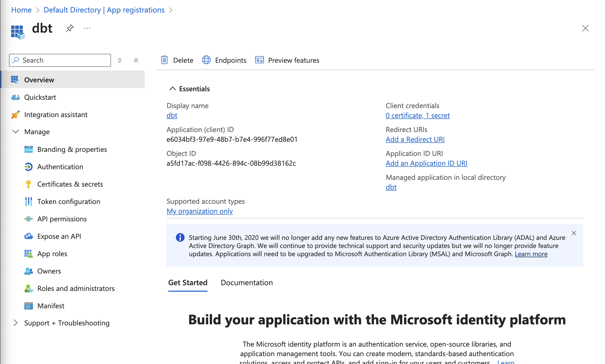
1. Click on *Certificates & secrets*
    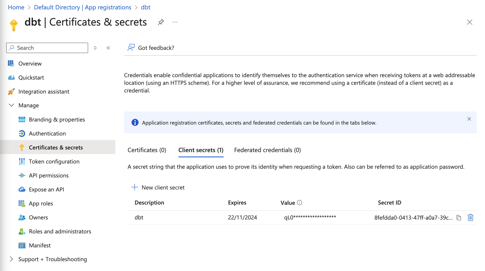
1. Click on *New client secret*
1. Copy the secret value.

### Get an access token from the management api

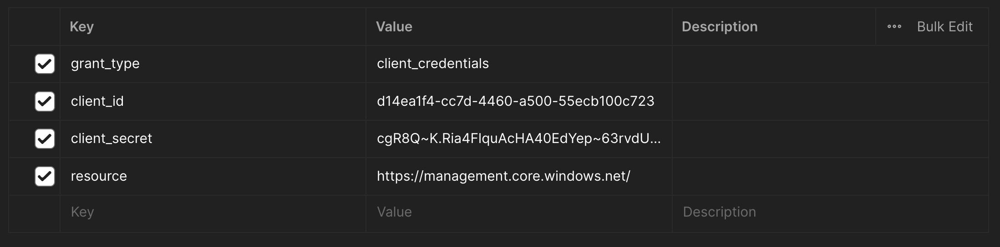

To request an access token, make a `/POST` request to the following endpoint:
```text
https://login.microsoftonline.com/${tenant_id}/oauth2/token
```
The payload must be urlencoded and it must contain the following keys/value pairs:

| key | value
| ----|---------
| *grant_type* | `client_credentials`
| *client_id* | `<application_id>`
| *client_secret* | `<client_secret>`
| *resource* | `https://management.core.windows.net/`


## How to trigger a containerapp job via the Azure Management REST API
A containerapp job can be triggered by making a `/POST` request to the following endpoint:

```text
https://management.azure.com/subscriptions/${subscription_id}/resourceGroups/${resource_group}/providers/Microsoft.App/jobs/${containerapp_job_name}/start?api-version=2023-11-02-preview
```

Provide the access token in the *Authorization* header.

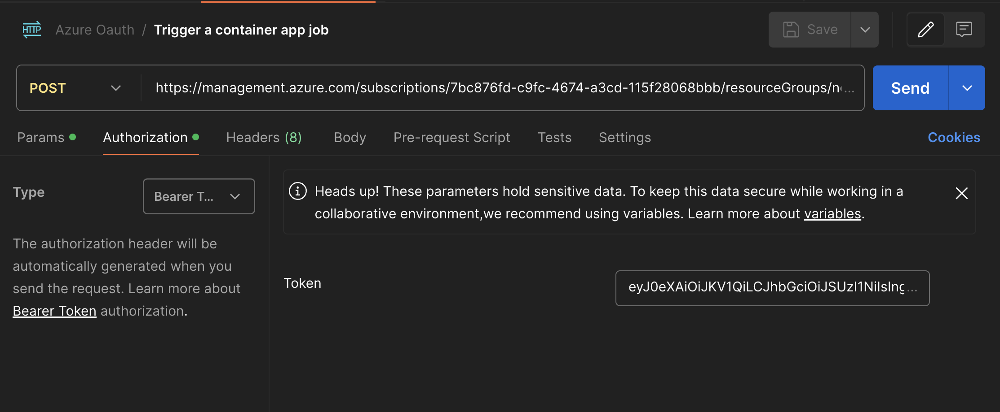


## How to check the status of a containerapp job run
You can check the status of a containerapp job run by making a `/GET` request to the following endpoint.

```text
https://management.azure.com/subscriptions/${subscription_id}/resourceGroups/${resource_group}/providers/Microsoft.App/jobs/${containerapp_job_name}/executions/${containerapp_job_execution_name}?api-version=2023-11-02-preview
```

Provide the access token in the *Authorization* header.

## Inspect Job runs

Inspect dbt job runs in the log analytics workspace provisioned for the project - *dbt-log-analytics-workspace*

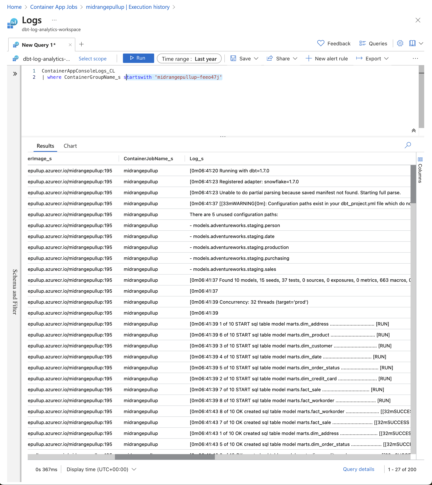

Logs in the analytics workspace can be queried with Microsoft's [*Kusto Query Language (KQL)*](https://learn.microsoft.com/en-us/azure/data-explorer/kusto/query/).

# Conclusion
We now have a workflow that we can use to run dbt jobs in azure containerapps instead of dbt cloud. If you don't need all the bells and whistles that come with dbt cloud then it's worth exploring other ways of running dbt jobs, such as Azure ContainerApps.

# Clean up
1. Delete the azure containerapp job in the portal because it's not managed using terraform.

1. Use the script below to deprovision the rest of the resources.
    ```bash
    # navigate to resource directories and deprovision all resources tracked by terraform
    cd IaC/
    terraform destroy -auto-approve
    cd ../IaC-ServicePrincipal
    terraform destroy -auto-approve
    ```

# References
## Improve the build time of build pipelines
https://stackoverflow.com/questions/62420695/how-to-cache-pip-packages-within-azure-pipelines

## Service Principals
Automated tools that use Azure services should always have restricted permissions to ensure that Azure resources are secure. Therefore, instead of having applications sign in as a fully privileged user, Azure offers service principals. An Azure service principal is an identity created for use with applications, hosted services, and automated tools. This identity is used to access resources.

https://learn.microsoft.com/en-us/cli/azure/authenticate-azure-cli-service-principal

https://learn.microsoft.com/en-us/cli/azure/azure-cli-sp-tutorial-1?tabs=bash

## Logging commands
https://learn.microsoft.com/en-us/azure/devops/pipelines/scripts/logging-commands?view=azure-devops&tabs=bash
